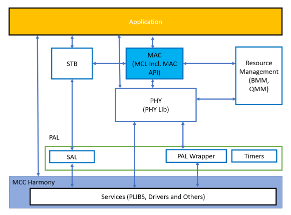

# MAC Architecture

The standalone IEEE 802.15.4 MAC stack architecture follows the layered approach and its  depicted below.

 

 

-   **[Platform Abstraction Layer \(PAL\)](GUID-0A24CE7D-8A7D-46A6-88EE-3BCDB2D17F16.md)**  

-   **[Physical Layer \(PHY Layer\)](GUID-0708B1BA-12E3-44C5-AE21-FB3952ACC2D5.md)**  

-   **[MAC Core Layer \(MCL\)](GUID-1B469762-FD50-4F52-89D0-A6511AB8D5D5.md)**  

-   **[Other Stack Components](GUID-25E87729-19EF-46AC-A69C-DB0025F4D8BE.md)**  

