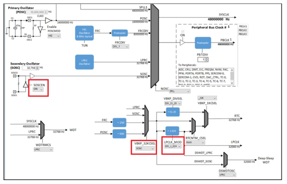
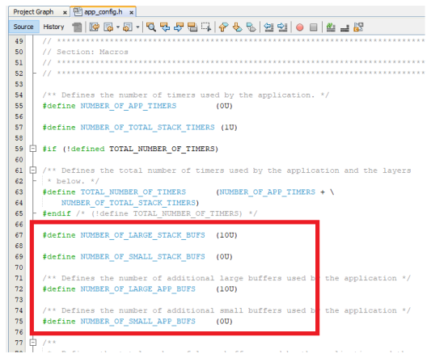

# MiWi Mesh Configurations

In the MPLAB Code Configurator \(MCC\), perform the following steps to configure the device in  MiWi mesh network.

1.  When the Project graph is displayed for the created project, double click on the MiWi component.

    

    **Note:** MiWi component and wireless\_15\_4\_phy will appear in Device Resources only if, `wireless_miwi` and `wireless_15_4_phy repo` is cloned in MCC framework path.

2.  Click **Yes** in the Components auto-activation confirmation dialog box.

    

3.  Again, click **Yes** in the Components auto-activation confirmation dialog box. This adds the following components to the project.

    -   Device Support Library
    -   Core
    -   TRNG
    -   SYSTEM Time module

        **Note:** PHY uses one client of SYS\_TIME\_MODULE, therefore the number of SYS\_TIME\_CLIENT must be more than 1.

    

4.  In Project Graph tab, click the TIME component and choose *Satisfiers* \> *TC0 \(tc0\)* to select the timer source.

    

5.  In Device Resources pane, click **WBZ451 Curiosity BSP**.

    

    The project graph appears with the MiWi protocol configuration.

6.  In Project Graph tab, click the MiWi component to open the Configuration Options pane for MiWi.

    

7.  \(Optional\) To enable the Console, perform the following:
    1.  Check the Enable Console check box.
    2.  Right-click on Console Driver, go to *Satisfiers*\> *SERCOM0\(sercom0\)*.
    3.  Click SERCOM0 component.
    4.  In the Configuration Options pane, change the Receive Pinout, Transmit pinout, TX Ring buffer size and RX Ring buffer size as “256�.

        

    5.  Configure the SERCOM0 System setting to enable the Direct High Speed \(see following figure\).

        

8.  To enable PDS storage, perform the following:

    1.  In Project Graph tab, click the PDS\_SubSystem component to open the Configuration Options pane for PDS SubSystem.
    2.  Configure the following settings:
        -   PDS\_APPS\_ITEM\_IDS as *10*
        -   PDS\_APPS\_DIRECTORY\_IDS as *1*
    

9.  In Project Graph tab, click the IEE 802.15.4 PHY component. The Configuration Options pane displays the settings for the IEE 802.15.4 PHY component.

    

    1.  Set the Large Buffers as *10*.
    2.  Set the Small Buffers as *3*.
10. In Project Graph tab, click the TIME component. The Configuration Options pane displays the settings for the TIME component.

    

    1.  Change the Number of Clients as *10*. Set this value based on software timers.

        **Note:** If the number of timers is less than 5, user need not change this value to 10.

11. To enable the Device Sleep feature, perform the following:

    

    1.  In Project Graph tab, click the MiWi component to open the Configuration Options pane for MiWi.
    2.  Configure the following settings:
        -   Check the “Enable Deep Sleep� checkbox.

            Enabling the sleep option will add  the dependent modules to the project and prompts for approval.

        -   Select “Yes� for all of them.
12. In Project Graph tab, click the Device\_Support component. The Configuration Options pane displays the settings for the Device\_Support component.
    1.  Check the “Enable PMU Mode Setting�, and choose PMU Mode as “PMU\_MODE\_BUCK\_PWM�.
13. Click *Plugins* \> *Clock Configuration*. In the Clock Diagram tab, set the following parameters with the mentioned values:
    1.  SPLLPOSTDIV1 as *2*
    2.  SOSCEN as *ON*
    3.  VBKP\_32KCSEL as *SOSC*
    4.  LPCLK\_MOD as *DIV\_1\_024*

        

        

14. To generate the code, click **Generate**. Upon code generation, MiWi files will be added to the project.

    

15. After successful generation of MiWi app, MiWi Mesh topology application is created as shown in the following figure.

    

16. A RTOS task for PHY Layer will be created and `miwi_Init()` will be called from `SYS_Initialize()` function.
17. To calibrate Zigbee Radio Subsystem \(ZBT\), open the source files from *config\>initialization.c*.
18. In the `initialization.c` file, change argument of `SYS_Load_Cal ()` function from `WSS_ENABLE_NONE`to `WSS_ENABLE_ZB`.
19. Perform the changes as mentioned in `app_user_edits.c` file.
20. In `app_config.h` file, perform the Buffer Size configurations as shown in the following figure.

    

21. In `tasks.c` file, perform the task priority configurations as shown in the following figure.

    

22. To build the project, right click on the project file name and select **Clean and Build**.

**Parent topic:**[MCC Configurations for MiWi Topologies](GUID-7C1892D2-1B15-442D-B7C8-6BE3C5CB1B72.md)

