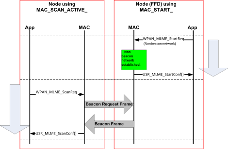

# Starting a PAN network

The first action the next higher layer takes for starting the PAN is to reset the MAC  layer. After resetting the MAC sublayer, NHLE layer is to initiate a scan to search for  other PANs in the area. An active scan is required, and an ED scan may optionally be  performed.

The first action the next higher layer takes for starting the PAN is to reset the MAC  layer. After resetting the MAC sublayer, NHLE layer is to initiate a scan to search for  other PANs in the area. An active scan is required, and an ED scan may optionally be  performed.

Following is the procedure for starting the PAN network,

-   Resetting the MAC Layer - **[WPAN\_MLME\_ResetReq](GUID-E48D2F16-7917-4A45-894C-7B80A33B71C8.md)**\(true\)
-   Scanning the Channels Supported \(Select the channel, PANId, Short Address based on scan results\) –

**[WPAN\_MLME\_ScanReq](GUID-B509C8FA-73E4-41DD-919F-053955BEB0FA.md)**\(MLME\_SCAN\_TYPE\_ACTIVE,  SCAN\_CHANNEL\(current\_channel\), SCAN\_DURATION\_LONG, current\_channel\_page\)

-   Starting the network on a particular PAN ID.

Upon starting the network, Coordinator will be able to

-   Respond to beacon request frames \(active scan by another node\) with proper beacon frames.
-   Perform network realignment and transmit coordinator realignment frames \(initiated by calling function **[WPAN\_MLME\_StartReq](GUID-F06E1F1E-B885-41E1-BC72-68CDC78EF002.md)** \(\) with parameter CoordinatorRealignment = true\)

PAN Start message sequence of coordinator is depicted in the below picture,

**Parent topic:**[Message Sequence for various MAC functionalities](GUID-0E9F7202-4517-4ECB-8255-651BFD5B1B75.md)

