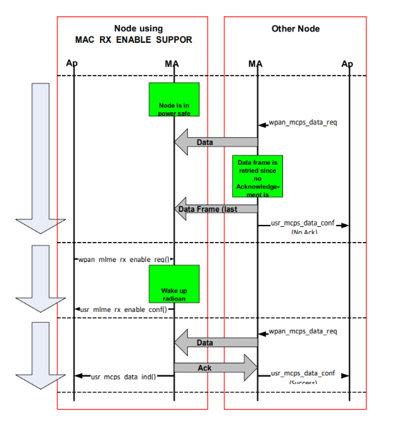

# Data Transmission

Data Transmission between two devices is achieved by calling the following WPAN API,

  **[WPAN\_MCPS\_Datareq](GUID-AB56B4B4-C121-434F-9F04-B2D6815A2C5D.md)**\(uint8\_t SrcAddrMode, WPAN\_AddrSpec\_t \*DstAddrSpec,  uint8\_t msduLength, uint8\_t \*msdu, uint8\_t msduHandle, uint8\_t TxOptions\);

-   In this TxOptions provides the way to initiate Direct/Indirect/acknowledged/unacknowledged transmission.
-   If the TxOptions parameter specifies that an indirect transmission is required and this primitive is received by the MAC sublayer of a coordinator, the data frame is sent using indirect transmission, i.e., the data frame is added to the list of pending transactions stored on the coordinator \(indirect queue\) and extracted at the discretion of the device concerned.
-   If the TxOption parameter specifies that an acknowledged transmission is required, MAC sublayer will set ACK request bit in FCF of MAC frame.

**Parent topic:**[Message Sequence for various MAC functionalities](GUID-0E9F7202-4517-4ECB-8255-651BFD5B1B75.md)

