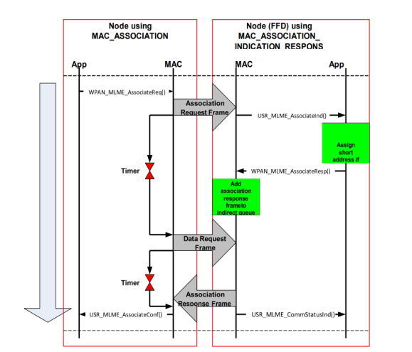

# Association

This feature allows a node \(both RFD and FFD\) to associate to a parent \(PAN Coordinator  or Coordinator\). to initiate an association procedure \(by transmitting an association  request frame\) and handle the reception of an association response frame. In case a  short address is desired , this will be requested by the parent if allowed. All required  timers for the association process are handled as well.

The node is able accept and process a request from its upper layer \(for example, the  network layer\) to associate itself to another node \(that is, its parent\).

Following is the procedure for associating to the PAN network,

-   Resetting the MAC Layer - **[WPAN\_MLME\_ResetReq](GUID-E48D2F16-7917-4A45-894C-7B80A33B71C8.md)**\(true\)
-   Scanning the Channels Supported \(Select the channel, PANId, Short Address based on scan results\) –

**[WPAN\_MLME\_ScanReq](GUID-B509C8FA-73E4-41DD-919F-053955BEB0FA.md)**\(MLME\_SCAN\_TYPE\_ACTIVE,  SCAN\_CHANNEL\(current\_channel\), SCAN\_DURATION\_LONG, current\_channel\_page\)

-   Associating to the co-ordinator \(Based on scan results\) –

  **[WPAN\_MLME\_AssociateReq](GUID-874B7D32-43B7-4092-AEDF-D600FDD95170.md)**\(coordinator→LogicalChannel,  coordinator→ChannelPage, &\(coordinator→CoordAddrSpec\), WPAN\_CAP\_ALLOCADDRESS\).

**Parent topic:**[Message Sequence for various MAC functionalities](GUID-0E9F7202-4517-4ECB-8255-651BFD5B1B75.md)

